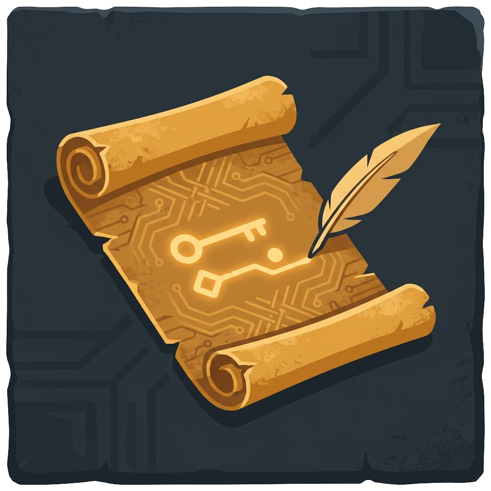

<p align="center">
  
</p>

# Chronicle

A persistent, reactive fact store for Godot 4.6+. Any node can record facts, and any other node can query or react to them without either needing to know the other exists.

Game state in Godot typically lives in scattered autoload variables, with signals wired between every writer and reader. Adding save/load means manually serializing each field. There is no history, no rollback, and removing one node silently breaks observers elsewhere. Chronicle replaces all of that with a single keyed store that handles persistence, reactivity, and history automatically.

```gdscript
# Write from anywhere
Chronicle.set_fact("player.gold", 100)
Chronicle.set_fact("quest.started")

# React without wiring signals (any writer triggers this)
Chronicle.watch("player.gold", func(key, value, old_value):
    gold_label.text = str(value)
)

# Save and load in one call
Chronicle.save_file("user://save.json")
Chronicle.load_file("user://save.json")

# Undo the last 3 changes
Chronicle.rollback_steps(3)
```

Or skip scripts entirely and add companion nodes in the Inspector:

```
KeyPickup (Area2D)
└── ChronicleRecorder       # trigger_signal: "body_entered", fact_key: "key.collected"

TreasureChest (Node2D)
└── ChronicleGate            # condition: "key.collected", gate_mode: HIDE_WHEN_FALSE
```

No coupling between the two nodes. No scripts on the chest.

## Features

- **Reactive watchers.** Push-based callbacks when facts change, no signal wiring needed.
- **Companion nodes.** Gate, Reactor, and Recorder let you wire facts to scene behavior in the Inspector.
- **Expression language.** Evaluate conditions like `"player.gold >= 100 AND quest.done"` in gates or scripts.
- **Timeline and rollback.** Full history of every write. Undo to any point in time.
- **Save/load.** One-call persistence with crash-safe atomic writes and version migration.
- **Expiring facts.** Built-in TTL with automatic cleanup.
- **Debug overlay.** F9 runtime panel with fact feed, inspector, and performance monitor.

## Installation

1. Download or clone this repository, then copy the `addons/chronicle/` folder into your Godot project root
2. Enable the plugin: **Project > Project Settings > Plugins > Chronicle**
3. Done. `Chronicle` is now a global autoload.

## Documentation

Full documentation is in the [`docs/`](docs/) folder:

| Doc | Topic |
|-----|-------|
| [01-QUICK-START](docs/01-QUICK-START.md) | 5-minute setup guide |
| [02-CORE-CONCEPTS](docs/02-CORE-CONCEPTS.md) | Facts, keys, values, constraints |
| [03-API-REFERENCE](docs/03-API-REFERENCE.md) | Every method with signatures and examples |
| [04-COMPANION-NODES](docs/04-COMPANION-NODES.md) | Gate, Reactor, Recorder nodes |
| [05-EXPRESSIONS](docs/05-EXPRESSIONS-AND-PATTERNS.md) | Condition syntax and glob patterns |
| [06-SERIALIZATION](docs/06-SERIALIZATION.md) | Save/load, migration, error handling |
| [07-DEBUG-OVERLAY](docs/07-DEBUG-OVERLAY.md) | Runtime inspection panel |
| [08-COOKBOOK](docs/08-COOKBOOK.md) | Practical recipes for common patterns |
| [09-BEST-PRACTICES](docs/09-BEST-PRACTICES.md) | Key naming, performance, architecture |
| [10-PITFALLS](docs/10-PITFALLS.md) | Common mistakes and how to fix them |
| [11-PERFORMANCE](docs/11-LIMITS-AND-PERFORMANCE.md) | Capacity planning and frame budgets |

## Requirements

- Godot 4.6+
- GDScript (no C# bindings)

## License

MIT
