# Chronicle Test Suite

This is the test project for [Chronicle](../../../README.md), a persistent, reactive
fact store for Godot 4. The suite runs on **GUT 9.6.0** and exercises the addon end to
end: the core fact store and write coordinator, the companion nodes, serialization and
file I/O, the expression/pattern engine, the editor integration, and a large body of
scenario, stress, and benchmark coverage. Conventions (helpers, assertion idioms,
fixtures) are documented in [`CLAUDE.md`](../CLAUDE.md) and enforced automatically by a
self-policing meta-test.

## Layout

Tests live under `test/`, one directory per tier:

- **core** — the fact store, write coordinator, watchers, timeline/rollback, expiry, the expression parser/evaluator, pattern matcher, serializer, key codec, and value utils.
- **production** — large, realistic scale and longevity tests that must run as their own process (memory-heavy).
- **integration** — cross-cutting acceptance flows that combine multiple subsystems.
- **nodes** — the companion nodes (`ChronicleGate`, `ChronicleReactor`, `ChronicleRecorder`) and their `_get_configuration_warnings()`.
- **io** — disk persistence (`save_file`/`load_file`), the file-I/O layer, and corrupt/partial-file handling.
- **editor** — editor-only integration (inspector/dock plugins) guarded for headless runs.
- **scenarios** — narrative, game-shaped end-to-end scenarios that read like a play session.
- **stress** — high-volume worst-case paths (deep cascades, dense watcher fan-out, huge timelines).
- **benchmarks** — the performance harness (`bench_` prefix); see [Benchmarks](#benchmarks) below.
- **meta** — the self-policing convention test that fails the build on reintroduced anti-patterns.
- **support** — shared test infrastructure (`ChronicleTestSuite`, `EventCollector`, `CompanionFactory`, the spy node, expression helpers). Not a tier — these have `class_name` and are reused everywhere.

## Running

> **Prerequisite:** GUT 9.6.0 is gitignored (`addons/gut/`), so a fresh clone won't include it. Install GUT (via the Godot Asset Library or git) into the repo's `addons/` before running the suite.

**core and production MUST run as separate Godot processes** — combined in one run they
exhaust memory (OOM). Benchmarks are also a separate, slow process. The exact commands
(kept in sync with [`CLAUDE.md`](../CLAUDE.md)):

```bash
# Core (+ integration / nodes / io / editor / scenarios / stress) — one process
godot --headless -s addons/gut/gut_cmdln.gd -gdir=test/core,test/integration,test/nodes,test/io,test/editor,test/scenarios,test/stress

# Production — separate process
godot --headless -s addons/gut/gut_cmdln.gd -gdir=test/production

# Meta convention check — separate, fast
godot --headless -s addons/gut/gut_cmdln.gd -gdir=test/meta
```

## Quality guarantees

These are mechanical guarantees, not aspirations:

- **Engine-error gate.** `.gutconfig.json` sets `"failure_error_types": ["engine"]`, so any
  runtime `SCRIPT ERROR` (invalid access, wrong-arity call, nonexistent function) **fails**
  the test instead of being silently logged while the test "passes". A test that
  intentionally triggers an engine error (corrupt-file I/O, editor-only classes, malformed
  regex) must declare it with `assert_engine_error_count(N, "why")` to consume the expected
  error. `push_error`/`push_warning` are not gated — Chronicle's own validation warnings do
  not fail tests.
- **Self-policing meta-test.** `test/meta/test_suite_conventions.gd` scans every `.gd` file
  under `test/` and **fails the build** on reintroduced anti-patterns: `assert_true(true)`
  tautologies, `.has()` membership via `assert_true`, `assert_true(a > b)` ordering,
  null-compare via `assert_true`, audit-code function-name prefixes, and unguarded
  benchmarks. It uses a real first-argument analyzer (balanced over brackets and string
  literals, top-level reduction) rather than a fragile regex, so operators inside strings or
  nested lambdas do not produce false positives. Sanctioned exceptions carry a trailing
  `# meta-allow:<rule>` comment.
- **Benchmark correctness guards.** Every benchmark proves it measured real work via
  `guard(condition, msg)` (run for every scale in `run_scale_bench`, including the
  out-of-band guard for `memory_per_fact`), so a silent regression fails rather than
  benchmarking nothing. Because the write coordinator short-circuits an unchanged-value
  write before dispatch, ops whose cost depends on a real state change use
  `BenchHelper.measure_each(...)` so each iteration writes a genuinely different value — a
  bench cannot accidentally measure a suppressed no-op.
- **Coverage validated by mutation testing.** The suite was checked with mutation testing:
  **52 mutations injected, 47 killed**, and the **5 surviving gaps were closed** with new
  assertions. Coverage is measured by whether tests detect deliberately broken code, not by
  line counts.

## Benchmarks

`test/benchmarks/` holds ~100 benchmarks across three tiers, using the `bench_` prefix
(excluded from normal test runs) and run as a **separate, slow process** (up to several
minutes at 100K+ scale):

- **micro** — single-operation latency (fact read/write, watcher dispatch, query, expression eval, rollback, temporal lookups).
- **macro** — whole-frame and multi-step flows (game-frame simulations, cascade chains, companion nodes, save/load).
- **stress** — scaling behavior under load (facts, entities, watchers, timeline at increasing scale).

```bash
# Per tier
godot --headless -s addons/gut/gut_cmdln.gd -gdir=test/benchmarks/micro/  -gprefix=bench_
godot --headless -s addons/gut/gut_cmdln.gd -gdir=test/benchmarks/macro/  -gprefix=bench_
godot --headless -s addons/gut/gut_cmdln.gd -gdir=test/benchmarks/stress/ -gprefix=bench_

# Single file / single benchmark
godot --headless -s addons/gut/gut_cmdln.gd -gdir=test/benchmarks/micro/ -gprefix=bench_ -gselect=bench_fact_write.gd
godot --headless -s addons/gut/gut_cmdln.gd -gdir=test/benchmarks/micro/ -gprefix=bench_ -gselect=bench_fact_write.gd -gunit_test_name=test_bench_overwrite_with_watchers
```

Each run prints percentile tables to the console and appends a JSON file to
`bench_results/` (gitignored — hardware-specific). Results are **percentile-based**
(`min`/`p5`/`p25`/`median`/`p75`/`p95`/`max`/`mean`/`stddev`) and **machine-specific**: the
useful signal is the *scaling shape* across scales, not absolute microseconds.

Regenerate the Results section below after a bench run:

```bash
godot --headless -s res://test/benchmarks/core/report_generator.gd
```

The generator (`test/benchmarks/core/report_generator.gd`) reads the freshest JSON per
benchmark from the latest run date, writes one chart per chartable benchmark to
`test/bench_charts/`, and replaces everything between the `BENCH:GENERATED` markers below.
It has neither the `test_` nor the `bench_` prefix, so it is never picked up as a test or a
benchmark. Each chart is built as SVG and rasterized to **PNG** (via `rsvg-convert`, falling
back to ImageMagick, and to SVG if neither is installed) — PNG renders both on GitHub and in
editors whose markdown preview blocks local SVG, such as VS Code. Charts use a transparent
background and mid-gray text so they read correctly on light and dark themes alike.

## Results

<!-- BENCH:GENERATED:START -->

Measured on Godot 4.6 · linux · 200 iters/20 warmup · snapshot 2026-05-29T16:53:42Z (commit 6ed1d4c-dirty). Numbers are machine-specific; the meaningful signal is the SCALING SHAPE, not absolute µs.

### Tier: macro

#### bench_cascade_chain

<details>
<summary>8 more bench_cascade_chain benchmarks — tables</summary>

**deferred_queue_drain** (us/op)

| scale | median | p95 | vs prev |
| --- | ---: | ---: | ---: |
| 32 | 561.0 | 619.6 | — |
| 64 | 924.5 | 1091 | 1.65× |

| benchmark | scale | median | p95 | unit |
| --- | --- | ---: | ---: | --- |
| cascade_with_bulk | 10 keys | 81.0 | 87.0 | us/op |
| chain_depth_1 | depth 1 | 14.0 | 15.0 | us/op |
| chain_depth_3 | depth 3 | 39.0 | 41.0 | us/op |
| chain_depth_7 | depth 7 | 101.0 | 105.0 | us/op |
| chain_depth_8_deferred | depth 8 | 118.0 | 124.0 | us/op |
| fan_out_10 | 1->10 | 137.0 | 141.0 | us/op |
| fan_out_10_depth_3 | 10x10 | 1430 | 1466 | us/op |

</details>

#### bench_companion

<details>
<summary>8 more bench_companion benchmarks — tables</summary>

| benchmark | scale | median | p95 | unit |
| --- | --- | ---: | ---: | --- |
| gate_eval_complex | complex | 23.0 | 26.0 | us/op |
| gate_eval_simple | simple | 39.0 | 44.0 | us/op |
| gates_10_simultaneous | 10 gates | 143.0 | 148.1 | us/op |
| gates_50_mixed | 50 gates | 38.0 | 40.0 | us/op |
| mixed_companions | 10g+5r+3c | 169.0 | 182.0 | us/op |
| reactor_creation_filter | 10 react | 37.0 | 41.0 | us/op |
| reactor_dispatch | 5 react | 22.0 | 24.0 | us/op |
| recorder_signal_to_fact | 1 rec | 13.0 | 17.1 | us/op |

</details>

#### bench_game_frame

<details>
<summary>5 more bench_game_frame benchmarks — tables</summary>

**combat_frame** (us/frame)

| scale | median | p95 | vs prev |
| --- | ---: | ---: | ---: |
| 1K | 336.0 | 345.0 | — |
| 10K | 341.0 | 383.4 | 1.01× |
| 50K | 344.0 | 355.1 | 1.01× |

**dialogue_frame** (us/frame)

| scale | median | p95 | vs prev |
| --- | ---: | ---: | ---: |
| 1K | 31.0 | 32.0 | — |
| 10K | 32.0 | 33.0 | 1.03× |
| 50K | 32.0 | 35.0 | 1.00× |

**heavy_frame** (us/frame)

| scale | median | p95 | vs prev |
| --- | ---: | ---: | ---: |
| 1K | 7558 | 12693 | — |
| 10K | 15397 | 20322 | 2.04× |
| 50K | 47122 | 54572 | 3.06× |

**light_frame** (us/frame)

| scale | median | p95 | vs prev |
| --- | ---: | ---: | ---: |
| 1K | 49.0 | 53.0 | — |
| 10K | 54.0 | 63.0 | 1.10× |
| 50K | 52.0 | 56.0 | 0.96× |

**medium_frame** (us/frame)

| scale | median | p95 | vs prev |
| --- | ---: | ---: | ---: |
| 1K | 156.0 | 183.1 | — |
| 10K | 150.0 | 177.1 | 0.96× |
| 50K | 151.0 | 161.0 | 1.01× |

</details>

#### bench_save_load

<details>
<summary>8 more bench_save_load benchmarks — tables</summary>

| benchmark | scale | median | p95 | unit |
| --- | --- | ---: | ---: | --- |
| atomic_write_overhead_atomic | atomic | 10810 | 11732 | us |
| atomic_write_overhead_raw | raw | 923.0 | 1033 | us |
| deserialize_cold | 10K | 112469 | 121321 | us |
| deserialize_replace | 10K | 113546 | 122795 | us |
| file_write_read | 10K | 31370 | 39409 | us |
| serialize_large_timeline | 10K tl | 10819 | 13094 | us |
| serialize_mixed_types | 10K mix | 36378 | 44928 | us |
| serialize_primitives | 10K | 25966 | 32826 | us |

</details>

### Tier: micro

#### bench_expression

<details>
<summary>7 more bench_expression benchmarks — tables</summary>

| benchmark | scale | median | p95 | unit |
| --- | --- | ---: | ---: | --- |
| evaluate_complex | complex | 12.0 | 13.0 | us/op |
| evaluate_simple | simple | 3.00 | 3.00 | us/op |
| extract_keys | complex | 7.00 | 7.00 | us/op |
| parse_complex | complex | 12.0 | 12.0 | us/op |
| parse_simple | simple | 3.00 | 3.00 | us/op |
| tokenize_complex | complex | 34.5 | 37.1 | us/op |
| tokenize_simple | simple | 7.00 | 7.00 | us/op |

</details>

#### bench_fact_read

<details>
<summary>8 more bench_fact_read benchmarks — tables</summary>

**get_dictionary_nested** (us/op)

| scale | median | p95 | vs prev |
| --- | ---: | ---: | ---: |
| depth 1 | 2.00 | 2.00 | — |
| depth 3 | 3.00 | 3.00 | 1.50× |
| depth 5 | 4.00 | 4.00 | 1.33× |

**get_godot_types** (us/op)

| scale | median | p95 | vs prev |
| --- | ---: | ---: | ---: |
| Vector2 | 1.00 | 1.00 | — |
| Color | 1.00 | 1.00 | 1.00× |
| Transform2D | 1.00 | 1.00 | 1.00× |

**is_marked** (us/op)

| scale | median | p95 | vs prev |
| --- | ---: | ---: | ---: |
| bool | 1.00 | 1.00 | — |
| int 1 | 1.00 | 1.00 | 1.00× |
| string | 1.00 | 1.00 | 1.00× |
| int 0 | 1.00 | 1.00 | 1.00× |

| benchmark | scale | median | p95 | unit |
| --- | --- | ---: | ---: | --- |
| get_array_deep | 10 dicts | 17.0 | 22.1 | us/op |
| get_array_shallow | 10 ints | 3.00 | 4.00 | us/op |
| get_primitive | int | 0.790 | 0.970 | us/op |
| has_fact_hit | hit | 0.540 | 0.560 | us/op |
| has_fact_miss | miss | 0.530 | 0.560 | us/op |

</details>

#### bench_fact_write

**overwrite_with_watchers** (us/op)

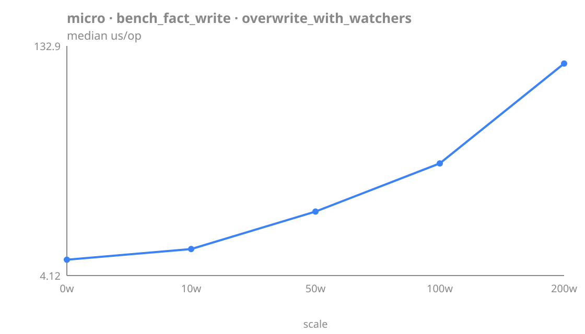

| scale | median | p95 | vs prev |
| --- | ---: | ---: | ---: |
| 0w | 13.0 | 14.0 | — |
| 10w | 19.0 | 20.0 | 1.46× |
| 50w | 40.0 | 44.0 | 2.11× |
| 100w | 67.0 | 71.0 | 1.68× |
| 200w | 123.0 | 127.0 | 1.84× |

<details>
<summary>7 more bench_fact_write benchmarks — tables</summary>

**erase** (us/op)

| scale | median | p95 | vs prev |
| --- | ---: | ---: | ---: |
| 1K | 26.0 | 27.0 | — |
| 10K | 27.0 | 35.0 | 1.04× |
| 50K | 28.0 | 29.1 | 1.04× |
| 100K | 28.0 | 29.1 | 1.00× |

**increment** (us/op)

| scale | median | p95 | vs prev |
| --- | ---: | ---: | ---: |
| 1K | 15.0 | 15.1 | — |
| 10K | 15.0 | 16.0 | 1.00× |
| 50K | 15.0 | 16.0 | 1.00× |

**insert_empty_store** (us/op)

| scale | median | p95 | vs prev |
| --- | ---: | ---: | ---: |
| 1K | 15.4 | 16.4 | — |
| 10K | 16.0 | 17.5 | 1.04× |
| 50K | 16.3 | 16.6 | 1.02× |

**insert_populated_store** (us/op)

| scale | median | p95 | vs prev |
| --- | ---: | ---: | ---: |
| 1K | 28.0 | 29.1 | — |
| 10K | 27.0 | 29.1 | 0.96× |
| 50K | 27.0 | 30.0 | 1.00× |
| 100K | 28.0 | 31.0 | 1.04× |

**overwrite_primitive** (us/op)

| scale | median | p95 | vs prev |
| --- | ---: | ---: | ---: |
| 1K | 12.8 | 13.3 | — |
| 10K | 12.8 | 13.0 | 0.99× |
| 50K | 13.2 | 13.4 | 1.03× |
| 100K | 13.2 | 13.4 | 1.01× |

**set_facts_bulk** (us/op)

| scale | median | p95 | vs prev |
| --- | ---: | ---: | ---: |
| 10 keys | 11.4 | 11.9 | — |
| 50 keys | 11.2 | 11.4 | 0.99× |
| 200 keys | 11.4 | 12.1 | 1.01× |

| benchmark | scale | median | p95 | unit |
| --- | --- | ---: | ---: | --- |
| overwrite_complex | 5-deep | 40.0 | 44.0 | us/op |

</details>

#### bench_query

<details>
<summary>8 more bench_query benchmarks — tables</summary>

**find_glob_large_bucket** (us/op)

| scale | median | p95 | vs prev |
| --- | ---: | ---: | ---: |
| 100 | 73.0 | 77.0 | — |
| 500 | 350.0 | 356.1 | 4.79× |

**find_wildcard** (us/op)

| scale | median | p95 | vs prev |
| --- | ---: | ---: | ---: |
| 1K | 315.0 | 325.0 | — |
| 10K | 7523 | 7768 | 23.88× |
| 50K | 37455 | 43730 | 4.98× |
| 100K | 77926 | 85727 | 2.08× |

| benchmark | scale | median | p95 | unit |
| --- | --- | ---: | ---: | --- |
| count_vs_find_count | count | 38.0 | 41.0 | us/op |
| count_vs_find_find | find | 73.0 | 77.0 | us/op |
| find_exact | 1K | 3.00 | 3.00 | us/op |
| find_glob_small_bucket | 10 props | 11.0 | 11.0 | us/op |
| first_change_deep | t=99.9 | 3997 | 4065 | us/op |
| first_change_shallow | t=0.0 | 4.00 | 5.00 | us/op |

</details>

#### bench_rollback

<details>
<summary>6 more bench_rollback benchmarks — tables</summary>

**rollback_steps** (us/op)

| scale | median | p95 | vs prev |
| --- | ---: | ---: | ---: |
| 1 | 16322 | 24039 | — |
| 10 | 34308 | 39807 | 2.10× |
| 50 | 26652 | 29464 | 0.78× |

**rollback_to_deep** (us/op)

| scale | median | p95 | vs prev |
| --- | ---: | ---: | ---: |
| 100 | 2207 | 2237 | — |
| 500 | 9398 | 10472 | 4.26× |
| 1000 | 18000 | 19389 | 1.92× |

| benchmark | scale | median | p95 | unit |
| --- | --- | ---: | ---: | --- |
| rollback_complex_values | 50 dicts | 2945 | 3355 | us/op |
| rollback_to_shallow | 10 | 314.0 | 330.1 | us/op |
| rollback_transient_skip | 50% trans | 1706 | 1851 | us/op |
| rollback_with_watchers | 50w | 1215 | 1492 | us/op |

</details>

#### bench_temporal

<details>
<summary>5 more bench_temporal benchmarks — tables</summary>

**changes_since_full** (us)

| scale | median | p95 | vs prev |
| --- | ---: | ---: | ---: |
| 1K | 2705 | 3002 | — |
| 10K | 24720 | 28587 | 9.14× |
| 50K | 141245 | 148469 | 5.71× |

**changes_since_recent** (us)

| scale | median | p95 | vs prev |
| --- | ---: | ---: | ---: |
| 1K | 30.0 | 32.0 | — |
| 10K | 251.0 | 255.0 | 8.37× |
| 50K | 1398 | 1456 | 5.57× |

**fact_history_hot** (us)

| scale | median | p95 | vs prev |
| --- | ---: | ---: | ---: |
| 100 | 261.0 | 310.1 | — |
| 500 | 1348 | 1540 | 5.16× |
| 1000 | 2648 | 2693 | 1.96× |

| benchmark | scale | median | p95 | unit |
| --- | --- | ---: | ---: | --- |
| changes_between_window | 10K | 2463 | 2496 | us |
| fact_history_cold | 2 in 10K | 4.00 | 5.00 | us |

</details>

#### bench_watcher

**dispatch_exact_scaling** (us/op)

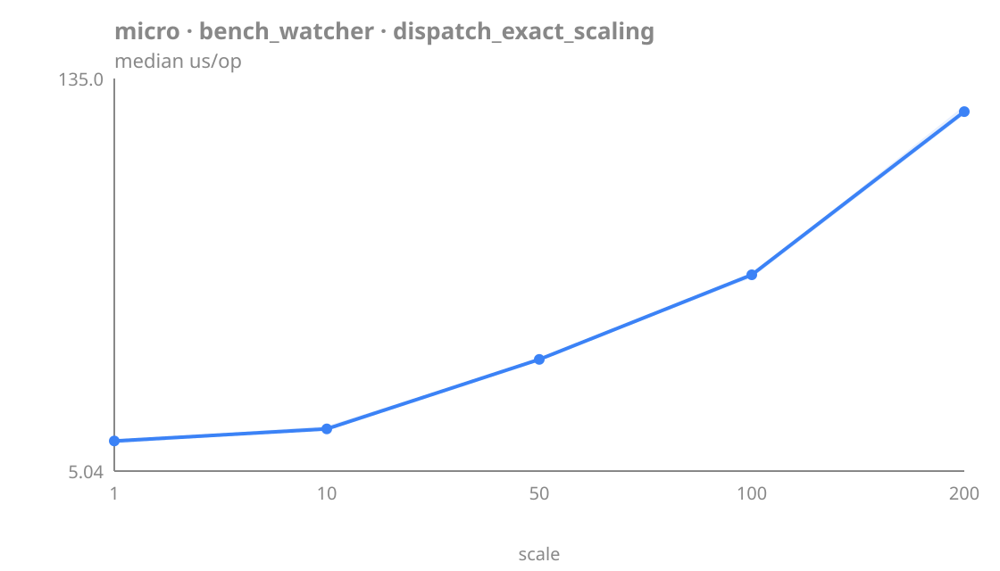

| scale | median | p95 | vs prev |
| --- | ---: | ---: | ---: |
| 1 | 15.0 | 16.1 | — |
| 10 | 19.0 | 21.0 | 1.27× |
| 50 | 42.0 | 46.0 | 2.21× |
| 100 | 70.0 | 74.0 | 1.67× |
| 200 | 124.0 | 129.0 | 1.77× |

<details>
<summary>9 more bench_watcher benchmarks — tables</summary>

**dispatch_glob_scaling** (us/op)

| scale | median | p95 | vs prev |
| --- | ---: | ---: | ---: |
| 1 | 15.0 | 17.0 | — |
| 10 | 15.0 | 17.0 | 1.00× |
| 50 | 19.0 | 21.0 | 1.27× |
| 100 | 24.0 | 26.1 | 1.26× |

| benchmark | scale | median | p95 | unit |
| --- | --- | ---: | ---: | --- |
| cache_invalidation_cached | cached | 19.0 | 20.0 | us/op |
| cache_invalidation_dirty | dirty | 96.5 | 130.0 | us/op |
| dispatch_mixed | 20e+10g | 36.0 | 40.0 | us/op |
| register_exact | 100 | 6.20 | 6.35 | us/op |
| register_glob | 100 | 5.51 | 7.29 | us/op |
| unwatch_cost | 100 | 5.58 | 5.71 | us/op |
| watch_once_vs_persistent_once | once | 366.0 | 469.9 | us/op |
| watch_once_vs_persistent_persist | persist | 42.0 | 46.0 | us/op |

</details>

### Tier: stress

#### bench_scale_entities

**find_glob_entity_count** (us/op)

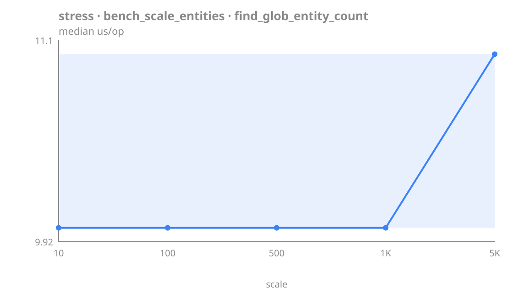

| scale | median | p95 | vs prev |
| --- | ---: | ---: | ---: |
| 10 | 10.0 | 11.0 | — |
| 100 | 10.0 | 11.0 | 1.00× |
| 500 | 10.0 | 11.0 | 1.00× |
| 1K | 10.0 | 11.0 | 1.00× |
| 5K | 11.0 | 11.0 | 1.10× |

**find_wildcard_vs_entities** (us/op)

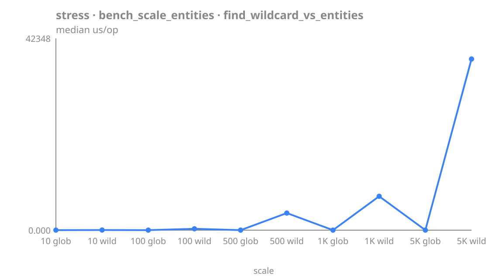

| scale | median | p95 | vs prev |
| --- | ---: | ---: | ---: |
| 10 glob | 11.0 | 11.0 | — |
| 10 wild | 33.0 | 34.0 | 3.00× |
| 100 glob | 11.0 | 12.0 | 0.33× |
| 100 wild | 306.0 | 335.1 | 27.82× |
| 500 glob | 11.0 | 11.0 | 0.04× |
| 500 wild | 3776 | 4691 | 343.23× |
| 1K glob | 11.0 | 11.0 | 0.00× |
| 1K wild | 7483 | 8097 | 680.27× |
| 5K glob | 11.0 | 11.0 | 0.00× |
| 5K wild | 37784 | 43227 | 3434.86× |

<details>
<summary>5 more bench_scale_entities benchmarks — tables</summary>

**expression_keys_scattered** (us/op)

| scale | median | p95 | vs prev |
| --- | ---: | ---: | ---: |
| 1 | 2.00 | 3.00 | — |
| 5 | 10.0 | 11.0 | 5.00× |
| 10 | 19.0 | 19.0 | 1.90× |
| 20 | 36.0 | 38.0 | 1.89× |

**find_glob_props_per_entity** (us/op)

| scale | median | p95 | vs prev |
| --- | ---: | ---: | ---: |
| 10 | 11.0 | 11.0 | — |
| 100 | 74.0 | 78.0 | 6.73× |
| 500 | 353.5 | 359.0 | 4.78× |
| 1000 | 709.0 | 719.0 | 2.01× |

**find_wildcard_vs_glob** (us/op)

| scale | median | p95 | vs prev |
| --- | ---: | ---: | ---: |
| 10 glob | 10.0 | 11.0 | — |
| 100 glob | 11.0 | 11.0 | 1.10× |
| 500 glob | 11.0 | 11.0 | 1.00× |
| 1K glob | 10.0 | 11.0 | 0.91× |
| 5K glob | 10.0 | 11.0 | 1.00× |

**find_wildcard_vs_wild** (us/op)

| scale | median | p95 | vs prev |
| --- | ---: | ---: | ---: |
| 10 wild | 32.0 | 32.0 | — |
| 100 wild | 311.0 | 317.0 | 9.72× |
| 500 wild | 3769 | 3896 | 12.12× |
| 1K wild | 7469 | 9233 | 1.98× |
| 5K wild | 41244 | 45101 | 5.52× |

**insert_new_entity** (us/op)

| scale | median | p95 | vs prev |
| --- | ---: | ---: | ---: |
| 10 | 16.0 | 17.0 | — |
| 100 | 16.0 | 18.0 | 1.00× |
| 500 | 18.0 | 19.0 | 1.12× |
| 1K | 18.0 | 19.0 | 1.00× |
| 5K | 18.0 | 20.0 | 1.00× |

</details>

#### bench_scale_facts

**erase_at_scale** (us/op)

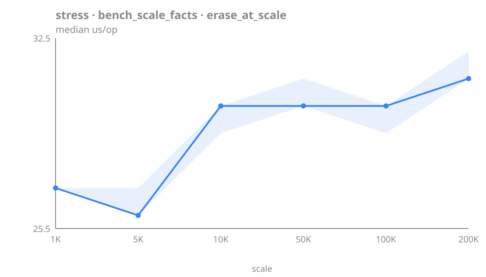

| scale | median | p95 | vs prev |
| --- | ---: | ---: | ---: |
| 1K | 27.0 | 29.0 | — |
| 5K | 26.0 | 27.0 | 0.96× |
| 10K | 30.0 | 31.0 | 1.15× |
| 50K | 30.0 | 31.0 | 1.00× |
| 100K | 30.0 | 31.0 | 1.00× |
| 200K | 31.0 | 34.0 | 1.03× |

**get_at_scale** (us/op)

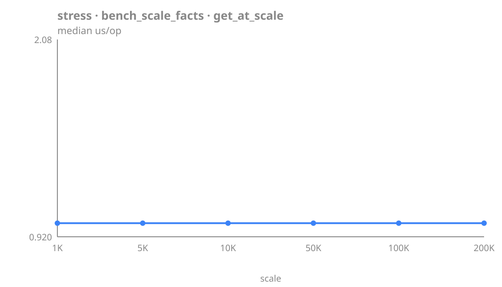

| scale | median | p95 | vs prev |
| --- | ---: | ---: | ---: |
| 1K | 1.00 | 1.00 | — |
| 5K | 1.00 | 1.00 | 1.00× |
| 10K | 1.00 | 1.00 | 1.00× |
| 50K | 1.00 | 1.00 | 1.00× |
| 100K | 1.00 | 1.00 | 1.00× |
| 200K | 1.00 | 1.00 | 1.00× |

**insert_at_scale** (us/op)

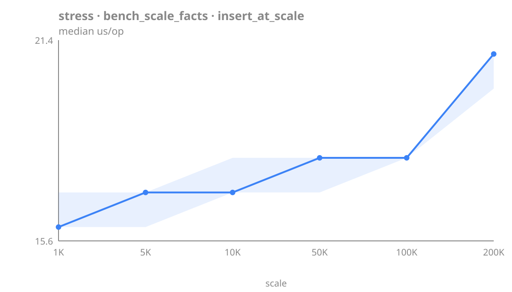

| scale | median | p95 | vs prev |
| --- | ---: | ---: | ---: |
| 1K | 16.0 | 18.0 | — |
| 5K | 17.0 | 18.0 | 1.06× |
| 10K | 17.0 | 18.0 | 1.00× |
| 50K | 18.0 | 19.0 | 1.06× |
| 100K | 18.0 | 20.0 | 1.00× |
| 200K | 21.0 | 23.0 | 1.17× |

<details>
<summary>3 more bench_scale_facts benchmarks — tables</summary>

**has_fact_at_scale** (us/op)

| scale | median | p95 | vs prev |
| --- | ---: | ---: | ---: |
| 1K | 1.00 | 1.00 | — |
| 5K | 1.00 | 1.00 | 1.00× |
| 10K | 1.00 | 1.00 | 1.00× |
| 50K | 1.00 | 1.00 | 1.00× |
| 100K | 1.00 | 1.00 | 1.00× |
| 200K | 1.00 | 1.00 | 1.00× |

**memory_per_fact** (bytes/fact)

| scale | median | p95 | vs prev |
| --- | ---: | ---: | ---: |
| 1K | 1568 | 1568 | — |
| 10K | 1544 | 1544 | 0.98× |
| 100K | 326.0 | 326.0 | 0.21× |

**overwrite_at_scale** (us/op)

| scale | median | p95 | vs prev |
| --- | ---: | ---: | ---: |
| 1K | 13.0 | 14.0 | — |
| 5K | 13.0 | 14.0 | 1.00× |
| 10K | 13.0 | 14.0 | 1.00× |
| 50K | 14.0 | 15.0 | 1.08× |
| 100K | 15.0 | 15.1 | 1.07× |
| 200K | 16.0 | 17.0 | 1.07× |

</details>

#### bench_scale_timeline

**append_at_depth** (us/op)

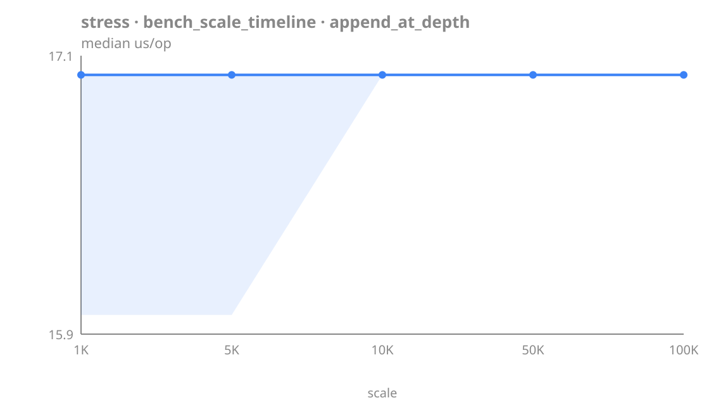

| scale | median | p95 | vs prev |
| --- | ---: | ---: | ---: |
| 1K | 17.0 | 17.1 | — |
| 5K | 17.0 | 17.0 | 1.00× |
| 10K | 17.0 | 18.0 | 1.00× |
| 50K | 17.0 | 18.0 | 1.00× |
| 100K | 17.0 | 18.0 | 1.00× |

**changes_since_bisect** (us)

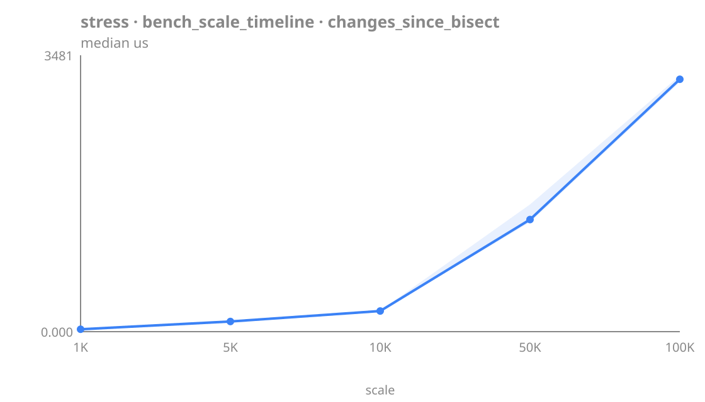

| scale | median | p95 | vs prev |
| --- | ---: | ---: | ---: |
| 1K | 30.0 | 32.0 | — |
| 5K | 128.0 | 132.0 | 4.27× |
| 10K | 260.0 | 280.0 | 2.03× |
| 50K | 1412 | 2043 | 5.43× |
| 100K | 3179 | 3337 | 2.25× |

**changes_since_full_scan** (us)

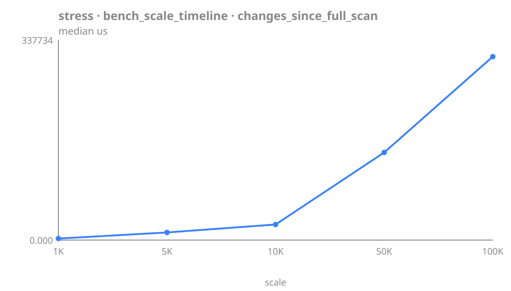

| scale | median | p95 | vs prev |
| --- | ---: | ---: | ---: |
| 1K | 2599 | 2627 | — |
| 5K | 12858 | 13419 | 4.95× |
| 10K | 26295 | 31024 | 2.05× |
| 50K | 147846 | 156982 | 5.62× |
| 100K | 309599 | 324093 | 2.09× |

**rollback_at_depth** (us)

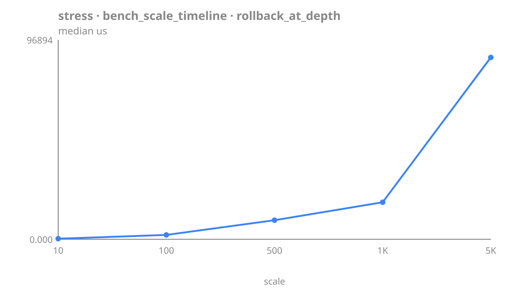

| scale | median | p95 | vs prev |
| --- | ---: | ---: | ---: |
| 10 | 264.0 | 280.1 | — |
| 100 | 2110 | 2147 | 7.99× |
| 500 | 9255 | 9934 | 4.39× |
| 1K | 17979 | 18630 | 1.94× |
| 5K | 88366 | 96488 | 4.91× |

<details>
<summary>3 more bench_scale_timeline benchmarks — tables</summary>

**fact_history_at_depth** (us)

| scale | median | p95 | vs prev |
| --- | ---: | ---: | ---: |
| 1K | 15.0 | 16.0 | — |
| 5K | 65.0 | 70.0 | 4.33× |
| 10K | 128.0 | 133.0 | 1.97× |
| 50K | 691.0 | 756.1 | 5.40× |
| 100K | 1568 | 1596 | 2.27× |

**serialize_at_depth** (us)

| scale | median | p95 | vs prev |
| --- | ---: | ---: | ---: |
| 1K | 8028 | 8178 | — |
| 10K | 89374 | 104919 | 11.13× |
| 50K | 496922 | 512664 | 5.56× |

| benchmark | scale | median | p95 | unit |
| --- | --- | ---: | ---: | --- |
| timeline_cap_trim | 1K cap | 31.0 | 34.0 | us |

</details>

#### bench_scale_watchers

**registration_at_scale** (us/op)

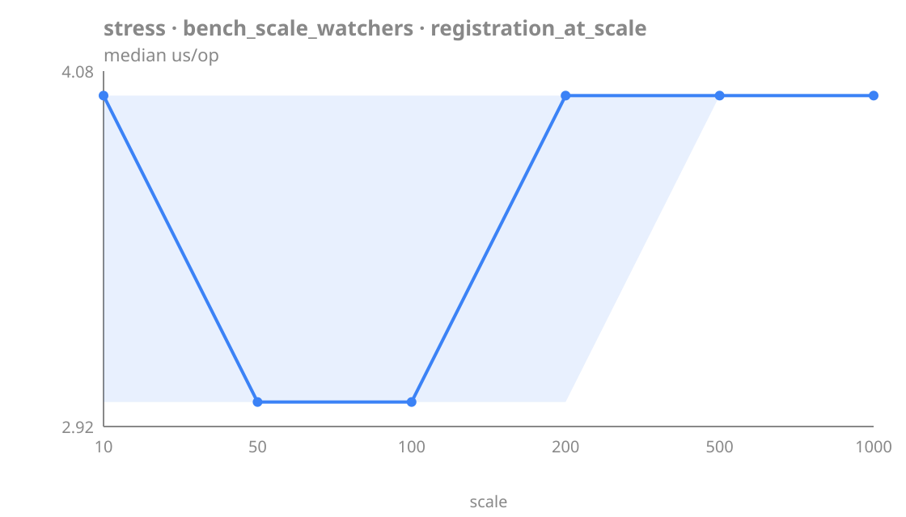

| scale | median | p95 | vs prev |
| --- | ---: | ---: | ---: |
| 10 | 4.00 | 5.05 | — |
| 50 | 3.00 | 4.00 | 0.75× |
| 100 | 3.00 | 5.00 | 1.00× |
| 200 | 4.00 | 5.00 | 1.33× |
| 500 | 4.00 | 5.00 | 1.00× |
| 1000 | 4.00 | 5.00 | 1.00× |

<details>
<summary>5 more bench_scale_watchers benchmarks — tables</summary>

**exact_watchers_on_hot_key** (us/op)

| scale | median | p95 | vs prev |
| --- | ---: | ---: | ---: |
| 10 | 19.0 | 27.1 | — |
| 50 | 40.0 | 43.0 | 2.11× |
| 100 | 67.0 | 71.0 | 1.68× |
| 200 | 122.0 | 127.0 | 1.82× |
| 500 | 305.0 | 322.1 | 2.50× |
| 1000 | 608.0 | 616.0 | 1.99× |

**glob_watchers_same_pattern** (us/op)

| scale | median | p95 | vs prev |
| --- | ---: | ---: | ---: |
| 10 | 23.0 | 25.0 | — |
| 50 | 64.0 | 67.0 | 2.78× |
| 100 | 113.0 | 117.0 | 1.77× |
| 200 | 210.0 | 220.1 | 1.86× |

**glob_watchers_unique_patterns** (us/op)

| scale | median | p95 | vs prev |
| --- | ---: | ---: | ---: |
| 10 | 15.0 | 16.0 | — |
| 50 | 14.0 | 15.0 | 0.93× |
| 100 | 15.0 | 15.0 | 1.07× |
| 200 | 14.0 | 15.0 | 0.93× |
| 500 | 15.0 | 15.0 | 1.07× |

**mixed_exact_glob_ratio** (us/op)

| scale | median | p95 | vs prev |
| --- | ---: | ---: | ---: |
| 50/50 | 167.0 | 172.0 | — |
| 80/20 | 139.0 | 144.1 | 0.83× |
| 95/5 | 126.0 | 131.0 | 0.91× |

**unwatch_at_scale** (us/op)

| scale | median | p95 | vs prev |
| --- | ---: | ---: | ---: |
| 10 | 4.00 | 4.00 | — |
| 50 | 4.00 | 4.00 | 1.00× |
| 100 | 4.00 | 4.00 | 1.00× |
| 200 | 4.00 | 4.00 | 1.00× |
| 500 | 4.00 | 4.00 | 1.00× |
| 1000 | 4.00 | 5.00 | 1.00× |

</details>


<!-- BENCH:GENERATED:END -->
